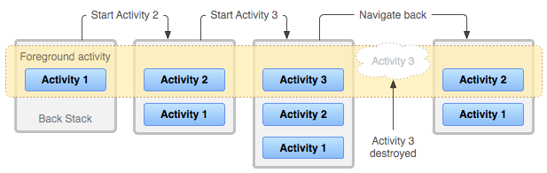
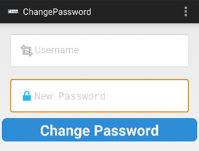
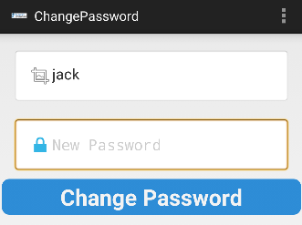

>『안드로이드 모바일 앱 모의해킹』을 참고해 금융권 앱을 모델로 가상으로 제작된 ‘인시큐어뱅크’ 앱으로 취약점 항목별로 실습을 했습니다.


## 4. 액티비티 컴포넌트 취약점
### 4.1 취약점 소개
- 안드로이드 액티비티는 애플리케이션을 구성하는 가장 기본적인 구성 단위 중 하나로, 안드로이드 애플리케이션과 사용자 간의 상호 작용에 필요한 기능을 제공한다.
- 액티비티는 `AndroidManifest.xml`의 `<activity>` 요소에 선언하며, 하나의 애플리케이션은 하나 이상의 액티비티로 구성되어 있다.
- 하나의 특정 액티비티는 **메인 액티비티**로 불리고, AndroidManifest에 매인 액티비티로 선언한다.
	- 메인은 애플리케이션 시작 시 나타나는 화면으로, 애플리케이션 실행 후 조건에 따라 설정된 액티비티가 호출된다.
	- 새로운 액티비티가 시작되면 이전에 실행되었던 액티비티는 잠시 멈추고 새로운 액티비티가 실행된다.
	- 멈춘 액티비티는 시스템에서 스택으로 관리하고, 새로운 액티비티가 종료되거나 스마트폰의 "뒤로가기"버튼을 누르면 스택에서 관리하던 액티비티 화면이 다시 실행되어 사용자에게 나타난다.
	
- 각 액티비티는 독립적으로 동작하기 때문에 현재 액티비티에서 다음 액티비티를 실행한다.
- 애플리케이션의 액티비티가 보안적으로 취약하게 선언되어 있으면 로직을 무시하고 공격자가 필요한 액티비티를 강제로 호출하며, 
- 해당 취약점을 악용하는 경우 권한이 없는 사용자가 특정 액티비티에 접근하여 권한 없이 특정 기능을 활성화할 수도 있다. (로그인 없이 계좌이체 화면 이동)

### 4.2 취약점 진단 과정
`AndroidManifest.xml`

```
<application
	android:theme="@android:style/Theme.Holo.Light.DarkActionBar"
	android:label="@string/app_name"
	android:icon="@mipmap/ic_launcher"
	android:debuggable="true"
	android:allowBackup="true">
	<activity
		android:label="@string/app_name"
		android:name="com.android.insecurebankv2.LoginActivity">
		<intent-filter>
			<action android:name="android.intent.action.MAIN"/>
			<category android:name="android.intent.category.LAUNCHER"/>
		</intent-filter>
	</activity>
	<activity
		android:label="@string/title_activity_file_pref"
	...
```

- `<application>` 요소 안에 여러 개의 `<activity>`가 포함되어 있고, 선언된 형태로 보아 각 액티비티는 독립적이다. 선언된 내용 중 `android:name` 속성은 액티비티 이름을 나타낸다

### ADB를 이용한 액티비티의 취약점 확인
- 이 장에서 중점적으로 볼 부분은 액티비티에 포함된 exported 속성이다
	- 해당 속성이 true인 경우에는 다른 애플리케이션에서 액티비티를 실행할 수 있고
	- false인 경우에는 동일한 애플리케이션에서만 실행할 수 있거나, 같은 사용자 ID를 가진 애플리케이션에서만 실행할 수 있다
- Exported 값이 포함되어 있지 않은 경우에는 기본적으로 `false`로 설정되지만, 선언된 액티비티에 `intent-filter`가 포함되면 true상태로 변경되어 다른 애플리케이션에서 `exported=true` 상태인 액티비티를 실행할 수 있다.

```
# adb shell am start com.android.insecurebankv2/.ChangePassword

Starting: Intent { act=android.intent.action.MAIN cat=[android.intent.category.LAUNCHER] cmp=com.android.insecurebankv2/.ChangePassword }
```
| -n 옵션 뒤에 "패키지명/.액티비티 경로"를 입력하여 특정 액티비티를 실행




- 정상적인 로직대로라면 애플리케이션>로그인>ChangePassword 버튼 과정이 있어야 하지만, 액티비티가 노출되어 실행 가능한 상태이므로 ChangePassword 액티비티를 바로 실행시킬 수 있다.

- 더 나아가 특정 사용자의 비밀번호를 변경까지 할 수 있다.

```java
    protected void onCreate(Bundle savedInstanceState) {  
        super.onCreate(savedInstanceState);  
        setContentView(R.layout.activity_change_password);  
        this.serverDetails = PreferenceManager.getDefaultSharedPreferences(this);  
        this.serverip = this.serverDetails.getString("serverip", null);  
        this.serverport = this.serverDetails.getString("serverport", null);  
        this.changePassword_text = (EditText) findViewById(R.id.editText_newPassword);  
        Intent intent = getIntent();  
        this.uname = intent.getStringExtra("uname");  
        System.out.println("newpassword=" + this.uname);  
        this.textView_Username = (TextView) findViewById(R.id.textView_Username);  
        this.textView_Username.setText(this.uname);  // 이 코드 (1)
        this.changePassword_button = (Button) findViewById(R.id.button_newPasswordSubmit);
        
        this.changePassword_button.setOnClickListener(new View.OnClickListener() { // from class: com.android.insecurebankv2.ChangePassword.1  
            @Override // android.view.View.OnClickListener  
            public void onClick(View v) {  
                ChangePassword.this.new RequestChangePasswordTask().execute(ChangePassword.this.uname);  // 이 코드(2)
            }  
        });  
    }
```
- 소스 코드를 보면 액티비티를 실행할 때 uname에 사용자 이름을 전달하고, 이 값을 `this.textView_Username.setText(this.uname);` 을 통해 화면에 표시하는 것을 알 수 있다.
- 비밀번호를 입력하고 버튼을 누르면 `RequestChangePasswordTask()`가 실행된다. 이 후에 나오는 코드는 입력된 값을 서버로 전송한다.

- 추가 옵션 없이 액티비티를 실행한 것과 달리 `Username`항목에 `jack` 이라는 값이 포함되어 액티비티가 실행된다.

```
# adb shell am start -n com.android.insecurebankv2/.ChangePassword --es uname jack

Starting: Intent { cmp=com.android.insecurebankv2/.ChangePassword (has extras) }
```



- 이후 `New Password` 항목에 `Test!123$`를 입력한 후 버튼을 눌러본다

```
# 백엔드 서버
The server is hosted on port: 8888
Test!123$
{"message": "Change Password Successful"}
```


### 4.3 취약점 대응 방안
- 노출된 액티비티를 통해 특정 액티비티를 강제로 실행하지 못하도록 하기 위해서는 `exported` 속성을 `false`로 변경해야한다.

```java
<activity  
	android:label="@string/title_activity_change_password"  
	android:name="com.android.insecurebankv2.ChangePassword"  
	android:exported="false"/>   //수정
```
- 만약 액티비티를 노출해야 하는 경우에는 액티비티에 Permission을 추가한 후 특정 권한을 가진 경우에만 실행하도록 설정한다.
- 또한 기본적으로 사용자 인증 절차를 추가하여 인증되지 않은 사용자의 접근을 차단하는 방법 등 애플리케이션 기능이나 사용자 재량에 따라 다양하게 적용할 수 있다.


<br><br>

---

## 5. 루팅 탐지 및 우회
### 5.1 취약점 소개
- 초창기 리눅스 커널을 기반으로 제작된 안드로이드는 리눅스에서 발생하는 취약점들을 내포하고 있다.
- 루트 노출 및 우회 취약점은 안드로이드 디바이스 시스템 권한을 얻는 것을 말한다.
- 리눅스 기반 운영체제의 경우, 시스템의 루트 권한 취득이 가능하지만, 안드로이드의 경우 보안상의 이유로 루트 권한을 막아 놓았다.
- 루팅에 성공하면 **슈퍼 유저(su)** 의 권한으로 다양한 디바이스 조작 등이 가능해지고, 루팅된 기기는 시스템 권한을 획득해 디바이스 내부의 민감한 정보에 접근할 수 있다.

### 5.2 취약점 진단 과정
>책에서는 기본적으로 루팅되어 있는 '제니모션'이라는 가상머신을 사용했습니다. 저는 '안드로이드 스튜디오 AVD'를 사용했으며, 'rootAVD'를 설치해서 따로 루팅해줬습니다.
>https://www.bobong.blog/post/etc/avd_android_13_rooting
>'Google APIs'이미지로 만든 에뮬레이터는 기본적으로 su 포함하고 있지만, 환경 문제로 인시큐어앱은 루팅을을 탐지하지 못했습니다.

- 루팅 체크가 필수적인 금융 앱이나 게임 앱에서는 다음과 같은 네 가지 경로를 주로 체크한다.
	- **/system/bin/su**
	- **/system/xbin/su**
	- **/system/app/superuser.apk**
	- **/data/data/com.noshufou.android.su**

- 인시큐어앱의 루팅 탐지 로직은 아래와 같다.

`PostLogin`
```java
void showRootStatus() {
	boolean isrooted = doesSuperuserApkExist("/system/app/Superuser.apk") || doesSUexist();
	if (isrooted) {
		this.root_status.setText("Rooted Device!!");
	} else {
		this.root_status.setText("Device not Rooted!!");
	}
}
private boolean doesSUexist() {
	Process process = null;
	try {
		process = Runtime.getRuntime().exec(new String[]{"/system/xbin/which", "su"});
		BufferedReader in = new BufferedReader(new InputStreamReader(process.getInputStream()));
		if (in.readLine() == null) {
			if (process != null) {
				process.destroy();
			}
			return false;
		}
		if (process == null) {
			return true;
		}
		process.destroy();
		return true;
	} catch (Throwable th) {
		if (process != null) {
			process.destroy();
		}
		throw th;
	}
}
private boolean doesSuperuserApkExist(String s) {
	File rootFile = new File("/system/app/Superuser.apk");
	Boolean doesexist = Boolean.valueOf(rootFile.exists());
	return doesexist.booleanValue();
}
```
- `doesSUexist()`는 `su`프로세스가 존재하는지 확인하고, `doesSuperuserApkExist()`와 `showRootStatus()`는 `superuser.apk` 파일이 존재하는지 확인한다.
- 확인 결과 나는 `/system/xbin/su` 에 su가 존재한다. 하지만 루팅을 탐지 하지 못하고 있다.
	-  `Runtime.getRuntime().exec(new String[]{"/system/xbin/which", "su"})` 는 `which su` 명령어를 실행하기 위한 코드지만, 안드로이드 버전에 따라 `which` 명령어의 위치가 `/system/xbin/`이 아닌 `/system/bin/`에 있거나 아예 없는 경우도 있다.
	- 나는 `/system/bin/`에 which가 있기 때문에 `which su`가 작동하지 않는다.

- 요즘 루팅 방식(Magisk 등)은 `Superuser.apk`라는 이름을 쓰지 않고, 시스템 폴더에 직접 APK를 심지도 않기 때문에 두 가지 조건을 모두 자동으로 우회되버렸다.

#### 책의 루팅탐지 우회 방법
- `/system/xbin/su`와 `Superuser.apk`가 모두 탐지된 상황을 가정하고 우회 방법을 알아보자.
- /system 디렉터리에 존재하는 파일을 수정하려면 only-read 상태로 마운트되기 때문에 시스템 파일을 수정할 수 없다. 따라서 **리마운트**해야 한다.
- 그후 Superuser.apk 이름을 `Superuser1.apk` 로 변경하고, su 실행파일 이름도 `su1`으로 바꾼다.

```bash
adb shell
su
mount -o remount,ew /system

mv Superuser.apk Superuser.apk1
mv su su1
```

- 그 밖에도 루팅탐지 우회 방법은 많고, 상황에 따라 적절히 바꿔야 하므로 진단은 여기서 마무리한다.

### 5.3 취약점 대응 방안
- 루팅을 방지하는 소스 코드 로직이 노출되지 않도록 해야 한다.
- 디컴파일하여 소스 코드를 열람하는데, 문자열 난독화까지 적용하여 어떤 명령어와 루팅 관련 파일을 검사하는지 모르게 해야 한다.
- apk파일을 조작하여 루팅을 지속적으로 유지하는 것을 방지하기 위해서는 무결성 검증이 필요하며, 디컴파일의 위험도 존재하기 때문에 디컴파일 방지 솔루션을 적용해야 한다.


<br><br>

---

## 6. 안전하지 않은 콘텐츠 프로바이더 접근
### 6.1 취약점 소개
- 안드로이드의 콘텐츠 프로바이더(`Content Provider`)는 앱 간에 데이터를 공유하기 위한 표준 인터페이스다. 안드로이드 시스템의 4대 구성 요소(Activity, Service, Broadcast Receiver, Content Provider) 중 하나로, 데이터의 보안과 무결성을 유지하면서 효율적으로 데이터를 전달하는 역할을 한다.
	- 이 기능을 이용하기 위해서는 애플리케이션에서 프로바이더가 선언되어야 한다.
	- 모든 콘텐츠 프로바이더는 `Androidmanifest.xml`의 `<provider>` 요소에 정의된다.
- 콘텐츠 프로바이더에 접근하기 위해서는 콘텐츠 프로바이더의 주소인 `URI`와 `콘텐츠 리졸버`가 필요하다

- 콘텐츠 프로바이더를 호출할 때는 URI 형식을 사용한다.
1. **Standard Prefix**: `content://` (콘텐츠 프로바이더가 관리하는 데이터임을 나타냄)    
2. **Authority**: `com.android.insecurebankv2...` (어떤 앱의 프로바이더인지 식별하는 고유 주소)    
3. **Path**: `/trackerusers` (해당 앱 내에서 어떤 데이터 테이블이나 파일에 접근할지 지정)

- 정상적인 경우, 대상 애플리케이션의 데이터베이스에 접근하지 못하고 사용자가 원하는 항목에만 접근하도록 하여 공유할 수 있다.
- 보안상 안전하지 않은 상태인 경우, 공격자는 민감한 데이터에 접근하여 저장된 데이터를 마음대로 조회하거나 변경할 수 있게 된다.

### 6.2 취약점 진단 과정
`Androidmanifest.xml`

```java
<provider
	android:name="com.android.insecurebankv2.TrackUserContentProvider"
	android:exported="true"
	android:authorities="com.android.insecurebankv2.TrackUserContentProvider"/>
```
- 코드를 보면 `authorities`를 확인할 수 있고, 세부적인 path는 해당 부분의 소스 코드 부분에서 확인 할 수 있다.


#### ADB를 이용한 콘텐츠 프로바이더 취약점 확인
- 다른 취약점 설명과 마찬가지로, `android:exported="true"` 로 설정되어 있으므로, 다른 애플리케이션에서 해당 콘텐츠 프로바이더를 이용 가능한 상태로 보고, 취약점 확인을 한다.
- 
`com.android.insecurebankv2.TrackUserContentProvider`

```java
public class TrackUserContentProvider extends ContentProvider {  
    ... 생략 ...
    static final String URL = "content://com.android.insecurebankv2.TrackUserContentProvider/trackerusers";
  
    static final Uri CONTENT_URI = Uri.parse(URL);  
    static final UriMatcher uriMatcher = new UriMatcher(-1);
   ...
```
- 인시큐어뱅크에서 설정된 URI의 전체 주소는 `content://com.android.insecurebankv2.TrackUserContentProvider/trackerusers`이다.
- 공격을 하기 위한 기본적인 정보가 모두 모이면 ADB를 이용하여 애플리케이션이 데이터를 확인한다.
- 이를 위해 콘텐츠 프로바이더를 이용하며, 여기서 사용하는 명령과 그 결과는 다음과 같다.

```
#adb shell content query --uri content://com.android.insecurebankv2.TrackUserContentProvider/trackerusers

Row: 0 id=1, name=dinesh
Row: 1 id=2, name=dinesh
Row: 2 id=3, name=dinesh
```
- 데이터를 조회하는 query()를 통해 로그인 내역이 나온것을 볼 수 있다.
- 공격자는 query, insert, delete 등의 메서드를 통해 데이터의 기밀성과 무결성을 해한다

```java
public int delete(Uri uri, String selection, String[] selectionArgs)
public String getType(Uri uri)
public Uri insert(Uri uri, ContentValues values2)
public boolean onCreate()
public Cursor query(Uri uri, String[] projection, String selection, String[] selectionArgs, String sortOrder)
public int update(Uri uri, ContentValues values2, String selection, String[] selectionArgs)
private static class DatabaseHelper extends SQLiteOpenHelper
```


### 6.3 취약점 대응 방안
- 콘텐츠 프로바이더를 통해 애플리케이션의 데이터가 유출되지 않도록 하기 위해서는 `manifest` 파일에 프로바이더를 선언할 때 `exported`를 `false`로 선언해야한다.
- 데이터를 **다른 앱에게 제공하는 것이 목적인 경우**에만 `true`로 설정하고, 이때는 `true`로 설정하되, 아무나 읽지 못하도록 **`android:permission`** 속성을 추가하여 특정 권한이 있는 앱만 접근하게 제한해야한다.\


<br><br>


---
## 7. 안전하지 않은 웹 뷰 실행
### 7.1 취약점 소개
- **WebView**는 안드로이드 앱 내부에서 웹 페이지를 직접 보여주기 위해 사용하는 브라우저 구성 요소입니다.
- 웹뷰의 설정이 미흡하거나 검증되지 않은 외부 입력을 허용하여 **공격자가 앱의 제어권이나 데이터에 접근할 수 있는 취약점**을 찾아본다.

- 웹뷰를 사용하기 위해서는 인터넷에 액세스할 수 있는 권한 필요하다. 인시큐어뱅크의 안드로이드 매니페스트 파일에는 다음과 같은 인터넷 사용 권한이 필요하다.
  `<uses-permission android:name="android.permission.INTERNET"/>`
- 다음으로 사용할 웹뷰의 객체를 선언하고, 실제 웹뷰를 사용할 때는 선언한 웹뷰 객체를 호출하여 `loadUri`를 통해 실행한다.
<uses-permission android:name="android.permission.INTERNET"/>
`ViewStatement` 클래스

```java
if (fileToCheck.exists()) {  
	WebView mWebView = (WebView) findViewById(R.id.webView1);  
	mWebView.loadUrl("file://" + Environment.getExternalStorageDirectory() + "/Statements_" + this.uname + ".html");  
	mWebView.getSettings().setJavaScriptEnabled(true);  
	...
```

### 7.2 취약점 진단 과정
> 이 취약점은 안드로이드 4.1.1버전에서 테스팅이 가능하다. 안드로이드 스튜디오로는 진행이 힘들고(별도의 이미지 설치 필요), 제니모션으로 환경구축이 가능하다.

#### 공격 시나리오 흐름도
1. **유도**: 공격자가 피해자에게 악성 링크(또는 피싱 페이지)를 클릭하게 만든다.    
2. **로드**: 앱 내 취약한 웹뷰가 공격자의 URL을 로드한다.    
3. **실행**: 웹뷰 설정에 따라 악성 자바스크립트가 실행된다.    
4. **탈취/조작**:    
    - `file://` 주소로 앱 내부 DB를 읽어 공격자 서버로 전송        
    - 노출된 인터페이스 메서드를 호출하여 앱의 관리자 기능을 실행        
5. **완료**: 사용자 모르게 정보가 유출되거나 기기 제어권이 넘어간다.

- 책에서는 메타스플로잇의 웹뷰 취약점 모듈을 이용해 만들었다.

### 7.3 취약점 대응 방안
1. **최소 권한 원칙**: 자바스크립트 및 파일 접근 기능을 기본적으로 비활성화한다.    
2. **화이트리스트**: 앱에서 허용한 안전한 도메인(HTTPS)만 로드하도록 필터링한다.    
3. **최신 API 사용**: `TargetSdkVersion`을 최신으로 유지하여 안드로이드 시스템의 기본 보안 기능을 활용한다.


## 참고
『안드로이드 모바일 앱 모의해킹』(조정원)