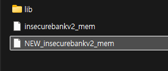
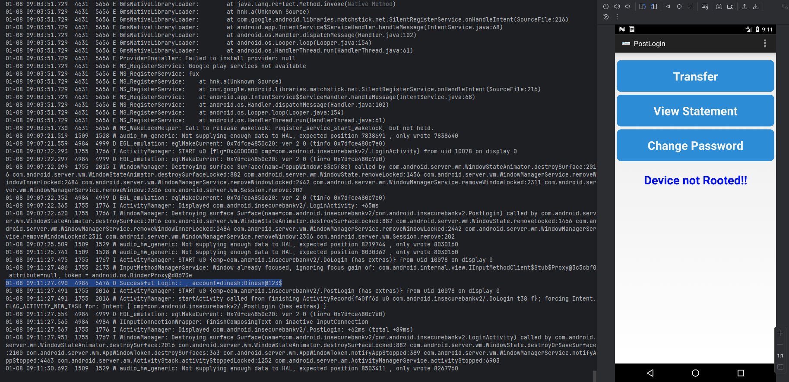
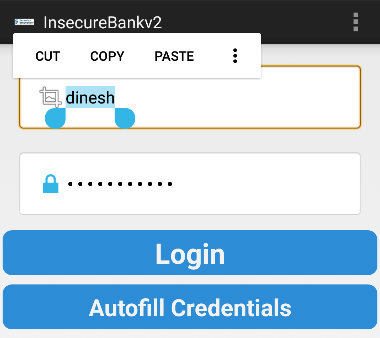
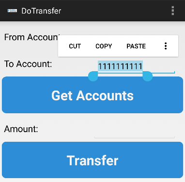
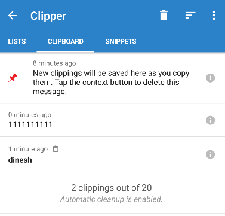

>『안드로이드 모바일 앱 모의해킹』을 참고해 금융권 앱을 모델로 가상으로 제작된 ‘인시큐어뱅크’ 앱으로 취약점 항목별로 실습을 했습니다.


## 8. 취약한 암호화 실행
### 8.1 취약점 소개
- 암호 알고리즘에 대한 취약점이다.
	- 개발 과정에서 민감한 데이터를 암호화가 아닌 인코딩을 통해 보내는 경우
	- 오래된 암호 알고리즘을 사용한 경우 (오래된 암호 알고리즘은 브루트포싱이나 전수 공격에 취약하기 때문에 키값을 갖고 있더라도 해독될 수 있다.)
	- 취약하다고 알려진 해시 알고리즘을 사용한 경우. (RC2, RC4, RC5, MD4, MD5, SHA1, DES, 3DES 등)

### 8.2 취약점 진단 과정
> 취약점 항목 3번(로컬 암호화 이슈)과 진단 과정이 비슷하다.

`LoginActivity.java`

```java
if (username != null && password != null) {  
	byte[] usernameBase64Byte = Base64.decode(username, 0);  
	try {  
		this.usernameBase64ByteString = new String(usernameBase64Byte, "UTF-8");  
	} catch (UnsupportedEncodingException e) {  
		e.printStackTrace();  
	}  
	this.Username_Text = (EditText) findViewById(R.id.loginscreen_username);  
	this.Password_Text = (EditText) findViewById(R.id.loginscreen_password);  
	this.Username_Text.setText(this.usernameBase64ByteString);  
	CryptoClass crypt = new CryptoClass();  
	String decryptedPassword = crypt.aesDeccryptedString(password);  
	this.Password_Text.setText(decryptedPassword);  
	return;  
}
```
- 아이디는 Base64로, 비밀번호는 AES로 암호화하고 있다.

`CryptoClass.java`

```java
public class CryptoClass {  
    String base64Text;  
    byte[] cipherData;  
    String cipherText;  
    String plainText;  
    String key = "This is the super secret key 123";  
    byte[] ivBytes = {0, 0, 0, 0, 0, 0, 0, 0, 0, 0, 0, 0, 0, 0, 0, 0};  
  
    public static byte[] aes256encrypt(byte[] ivBytes, byte[] keyBytes, byte[] textBytes) throws BadPaddingException, NoSuchPaddingException, IllegalBlockSizeException, NoSuchAlgorithmException, InvalidKeyException, UnsupportedEncodingException, InvalidAlgorithmParameterException {  
        AlgorithmParameterSpec ivSpec = new IvParameterSpec(ivBytes);  
        SecretKeySpec newKey = new SecretKeySpec(keyBytes, "AES");  
        Cipher cipher = Cipher.getInstance("AES/CBC/PKCS5Padding");  
        cipher.init(1, newKey, ivSpec);  
        return cipher.doFinal(textBytes);  
    }
```
- AES에 사용되는 키 값을 String 변수로 그대로 넣는 방식으로 하드코딩하여 취약점을 노출했다.
	- 안드로이드의 경우, 디컴파일을 통해 키값을 노출하고 싶지 않을 때는 해시 함수를 사용하여 키값을 생성하는 것이 안전하며, 키값을 외부 디렉터리에서 불러오는 것도 한 가지 방법이다.
- 또한, 초기화벡터 (`IV`)에는 전부 0값을 넣어 사용했다. 초기화 벡터는 프로그램이 실행된 후에 생성하는 것이 안전하다. 
	- 초기화 벡터는 운영 방식마다 사용 방법이 다르며, 요구하는 성질도 조금씩 다르지만, 같은 초기화 벡터를 반복적으로 사용하면 안된다는 공통점을 가진다. 
	- 왜냐하면 초기화 벡터값이 같은 경우, 비슷한 2개의 평문을 암호화했을 때 앞부분의 블록들이 서로 같아지는 문제점을 노출할 수 있기 때문이다.
	- 즉 초기화 벡터를 설정할 때는 가능한 **암호 알고리즘이 사용되기 직전에 계산하여 사용**하고, **사용한 직후에는 메모리에 남아 있는 IV를 0 값을 채워 넣는 방식으로 지우는 것이 안전**하다.
- 실제 암호화 로직을 살펴보면 `AES/CBC/PKCS5Padding`으로 설정되어 있는데, 이를 간단히 설명하면 초기화 벡터는 `AES` 알고리즘을 사용하여 `CBC` 모드로 운영하며, 패딩은 `PKCS5Padding` 방식으로 사용하는 것을 의하는데, 이 코드에서의 문제점은 **솔트값 없이 암호 알고리즘을 사용**했다는 점이다.

### 8.3 취약점 대응 방안
- 대칭키 암호 알고리즘을 사용할 때 주의할 점
	- 암호화 모드와 패딩을 명시적으로 지정한다
	- 강한 암호화 기술을 사용하며, 암호화 모드와 패딩을 포함한다.
	- 암호화키의 값은 솔트를 사용한다.
	- 암호화키의 값은 적절한 해시 반복 횟수를 지정한다,
	- 암호화 강도를 보장하기 위해 충분한 키의 길이를 사용한다.

<br><br>

---

## 9. 애플리케이션 패칭
### 9.1 취약점 소개
- 안드로이드 모바일 악성코드는 정상적으로 서비스되고 있는 앱을 조작하여 사용자들을 유인한다.
	- 공격자들도 앱을 처음부터 개발하는 것이 아니라 모두 개발된 앱에 원하는 데이터를 얻기 위한 코드들만 삽입하는 것이 효율적이다.
- 국내에 배포된 앱들은 금융권 정보를 노리는 사례가 많으며, 사용자의 개인 정보, 공인 인증서, 휴대폰 번호를 한 번에 탈취한다.
- 이 항목에서는 정상적인 앱을 어떤 방식으로 변조하고, 이에는 어떻게 대응하는지 본다.

### 9.2 취약점 진단 과정
- **디컴파일(Decompile)**: APK를 수정 가능한 소스(Smali) 형태로 풀기    
- **코드 수정(Patching)**: 원하는 로직 수정 (보안 우회, 로그 추가 등)    
- **리빌드(Rebuild)**: 수정된 코드를 다시 APK로 합치기    
- **서명(Signing)**: 안드로이드 설치를 위해 앱에 디지털 서명하기    
- **설치(Install)**: 기기에 설치 및 실행

- 환경상 apktool을 사용할 수 없어서 넘어가겠습니다.
<iframe width="740" height="416" src="https://www.youtube.com/embed/9niiMznwV_k" title="안드로이드 디코딩 도구 apktool 업데이트 소식과 간단 활용, 모의해킹 할 때 많이 사용됩니다." frameborder="0" allow="accelerometer; autoplay; clipboard-write; encrypted-media; gyroscope; picture-in-picture; web-share" referrerpolicy="strict-origin-when-cross-origin" allowfullscreen></iframe>

### 9.3 취약점 대응 방안
 1. 무결성 검사 (Integrity Check)
앱이 실행될 때 자신의 파일 상태가 원본과 일치하는지 확인하는 가장 핵심적인 방어책이다.
- **코드 체크섬(Checksum/Hash)**: 실행 파일(`classes.dex`)이나 주요 리소스의 해시값을 미리 계산해두고, 실행 시점에 현재 파일의 해시값과 비교한다. 값이 다르면 패칭된 것으로 간주하고 앱을 종료시킨다. 
- **파일 크기 확인**: APK 내 파일들의 크기가 변했는지 주기적으로 검사한다.

2. 서명 검증 (Signature Verification)
패칭된 앱은 공격자의 키로 다시 서명(Re-sign)되어야만 설치됩니다. 앱 내부 코드에서 **현재 앱의 서명 값(Signing Certificate)** 이 개발자의 원본 서명 값과 일치하는지 확인한다.

```Java
// 예시 로직: 현재 앱의 서명이 미리 정의된 원본 서명과 다르면 종료
if (!currentSignature.equals(ORIGINAL_SIGNATURE)) {
    System.exit(0);
}
```

3. 난독화 (Obfuscation)
공격자가 코드를 읽고 수정하는 것 자체를 어렵게 만듭니다.
- **ProGuard / R8**: 클래스명, 메서드명을 `a`, `b`, `c` 등으로 바꿔서 `jadx`나 `apktool`로 뜯어봐도 로직을 파악하기 힘들게 만든다. 
- **문자열 암호화**: "Success", "Login" 같은 핵심 키워드를 암호화하여 공격자가 패칭할 위치를 찾지 못하게 방해한다.

4. 서버 측 검증 (Server-side Validation)
중요한 로직은 앱 내부가 아닌 **서버**에서 처리한다.
- 앱이 단순히 "로그인 성공"이라는 결과만 서버에 알려주는 것이 아니라, 서버가 직접 인증 토큰을 발행하고 검증하게 하여 앱 패칭만으로는 권한을 얻을 수 없게 설계한다.

<br><br>

---

## 10. 메모리 내 민간함 정보 저장
### 10.1 취약점 소개
- 메모리는 물리적 메모리 RAM을 가리킨다.
- 우리가 앱에 입력하는 모든 입력값과 앱이 실행되는 모든 정보들이 메모리에 적재되어 실행한 후, 실행이 완료되면 다른 데이터들로 채워진다.

### 10.2 취약점 진단 과정
> 안드로이드의 메모리 구조는 Honeycomb 버전과 Oreo 버전을 경계로 나눠진다.
> ~Gingerbread (2.3) //  Honeycomb (3.0) ~ Nougat (7.1) // Oreo (8.0) ~ 현재(2026)
> 책에서는 4.2.2를 기준으로 테스트합니다. 

|**구분**|**초기 (G ~ Gingerbread)**|**전환기 (H ~ Nougat)**|**현재 (Oreo ~ 현재)**|
|---|---|---|---|
|**대상 버전**|Android 2.3 이하|Android 3.0 ~ 7.1|Android 8.0 이상|
|**비트맵 저장 위치**|**Native Memory**|**Java Heap**|**Native Memory**|
|**관리 주체**|개발자 (수동 관리)|Garbage Collector (GC)|GC + Native Allocation|
|**장점**|Java Heap 공간 절약|메모리 관리가 편리함|OOM 방지 및 성능 최적화|
|**단점**|메모리 누수 위험 높음|OutOfMemory(OOM) 빈번|구조적 복잡도 증가|

- 안드로이드에서는 자바 가상머신을 사용하지 않고 달빅(Dalvic) 가상 머신을 사용하여 앱을 구현한다.
- 프로세스가 실행될 때마다 달빅 가상머신을 사용하여 동작에 필요한 만큼의 메모리를 할당하고, 더 사용해야 한다면 프로세스당 허용된 메모리 한계 안에서 필요한 만큼의 메모리를 할당한다.
- 만약 허용된 메모리 한계 이상을 사용하면 `OOM` 에러가 발생한다.

#### ADB를 이용한 진단
> 실습하기에 앞서 메모리에 여러가지 정보를 남기기 위해 앱을 실행한 후 여러가지 작업을 한다.

```bash
adb shell am dumpheap 4984 /data/local/tmp/insecurebankv2_mem //쓰기 권한이 있는 경로
//adb shell am dumpheap [PID] [저장할 위치]

adb pull /data/local/tmp/insecurebankv2_mem "C:\Users\사용자\Desktop\Android"
//adb pull [다운로드할 파일 경로] [저장할 위치]
```


```bash
cd "C:\Users\사용자\AppData\Local\Android\Sdk\platform-tools"
 hprof-conv.exe "C:\Users\사용자\Desktop\Android\insecurebankv2_mem" "C:\Users\사용자\Desktop\Android\NEW_insecurebankv2_mem"
 
 //hprof-conv.exe [달빅 머신 hprof] [새로생성될 hprof 이름]
```



- 이후 HxD 프로그램으로 덤프된 메모리에서 민감한 정보를 볼 수 있다.

### 10.3 취약점 대응 방안
- 메모리 내에 모든 정보를 암호화하여 저장하기는 어려운 문제가 있다.
- 메모리 정보에는 중요한 정보를 일체 남기지 말아야 하지만, 사용자들이 입력한 결과는 일시적으로라도 남게 된다.
- 임시 파일과 캐시 정보들만 삭제한다고 해서 메모리 정보까지 삭제되는 것은 아니다. 메모리 데이터가 언제 유출될지 모르기 때문에 데이터가 100% 안전하다고 할 수는 없다.
- 금융권에서는 "스마트폰 보안 안전 대책 이행 실태 점검 체크리스트" 항목 중에서 "스마트폰 앱과 금융회사 전자 금융 서버 간의 종단 간 암호화 적용 여부" 점검에서 좀 더 확장하여 "확장 E2E"를 권고하고 있다.
	- 이는 키보드로 입력하는 순간부터 암호화하여 최종적으로 체크하는 서버까지 암호가 되는 형태이다.
	- 공격자들이 중간에 메모리값을 가로채더라도 암호화된 상태를 유지하는 것을 권고한다.

<br><br>

---

## 11. 안전하지 않은 로깅 메커니즘
### 11. 1 취약점 소개
- **안전하지 않은 로깅 메커니즘**은 민감한 데이터나 노출되면 안 될 정보들을 로그로 남길 경우에 발생하는 취약점이다.
- 안드로이드 로깅 시스템의 구조 (Logger Driver)
- 안드로이드는 로그를 파일로 저장하는 것이 아니라, 메모리상의 **링 버퍼(Ring Buffer)** 라는 특수한 영역에 저장한다.
	- **Logger Driver (커널 영역)**: 안드로이드 커널에는 로그 데이터를 관리하는 드라이버가 있다. 앱이 로그를 남기면 이 드라이버가 관리하는 메모리 버퍼에 순차적으로 기록된다.    
	- **Logcat (사용자 영역)**: 우리가 사용하는 `adb logcat`이나 안드로이드 스튜디오의 로그 창은 이 커널 버퍼에 쌓여 있는 데이터를 읽어서 보여주는 **클라이언트 도구**일 뿐이다.    
	- **링 버퍼(Ring Buffer) 방식**: 메모리는 한정되어 있으므로, 로그가 가득 차면 가장 오래된 로그부터 지우고 새로운 로그를 덮어쓴다.

- 로그 버퍼의 종류 (Buffer Types)
	- 안드로이드는 로그를 섞어서 저장하지 않고 목적에 따라 별도의 버퍼에 나눠 담는다.
	- **Main**: 일반적인 앱 로그 (우리가 분석하는 대부분의 취약점은 여기에 있다).    
	- **System**: 안드로이드 프레임워크 및 시스템 서비스 로그.    
	- **Event**: 바이너리 형식의 시스템 이벤트 로그 (부팅, 프로세스 시작 등).    
	- **Radio**: 통신(전화, 데이터, 블루투스) 관련 로그.    
	- **Crash**: 앱이 비정상 종료되었을 때의 스택 트레이스 정보

### 11.2 취약점 진단 과정
- logcat을 통해 로그를 쭉 확인할 수 있다.
```
adb shell
logcat
```


- 로그인 후 로그를 보면 평문으로 아이디 비밀번호 정보가 로깅되는걸 볼 수 있다.


- 로그인할 때 뿐만 아니라 비밀번호를 변경할 때에도 기존 패스워드와 변경된 패스워드를 평문으로 출력한다.
- 이런 로그 정보들은 각각의 로그 버퍼에 저장되어 있으며, 기기를 재부팅하거나  `logcat -c` 명령어로 로그 버퍼를 비워주지 않으면 정보가 계속 남아 있게 된다.
- 만약 공격자가 특정 앱이 로그 정보에 계정과 관련한 정보를 남긴다는 것을 알고 있고, 취약한 앱이 설치된 디바이스에 접근 권한을 얻었다고 가정해보자.
	- 이는 버퍼에 저장되어 있던 정보를 추출하거나 사용자가 취약한 앱을 사용할 때까지 로그를 수집하는 방법으로도 추출이 가능하다.

### 11.3 취약점 대응 방안
- 인시큐어뱅크 앱은 모든 민감정보가 로그를 통해 출력되었다.
- 로그와 소스코드를 같이 살펴보면 `Log.d`, `I.System.out`,  `system.out.println` 함수로 로그를 남긴다.
- 이 세 가지 코드를 모두 삭제하여 로깅을 비활성화하거나 제한한다.
- 로그 정보는 개발자에게 매우 유용하고 편리한 기능이지만, 앱을 배포하기 전에 제대로 제거하여 정보 노출을 방지한다.

<br><br>

---

## 12. 안드로이드 키보드 캐시 이슈
### 12.1 취약점 소개
- 키보드 캐시 이슈는 사용자가 중요 정보를 클립보드에 저장하면 제삼자가 이러한 정보를 획득할 수 있는 취약점이다. 
	
### 12.2 취약점 진단 과정
- 진단 대상이 되는 앱을 실행한 후 중요 정보를 복사할 수 있는 기능이 있는지 확인한다.
- 그리고 클리퍼와 같은 클립보드에 접근할 수 있는 앱을 설치한 후 중요 정보 복사 시 클리퍼 앱에서 노출되는지 확인한다.

<div style="display: flex; gap: 10px;">
  
  
</div>



- 클리퍼 앱에서는 사용자가 클립보드에 복사한 데이터가 노출된다.
- 이는 클리퍼뿐만 아니라 다른 악의적인 기능을 포함하고 있는 앱도 클립보드에 저장된 데이터에 아무나 권한 없이 접근할 수 있다는 것을 의미한다.
### 12.3 취약점 대응 방안
- 중요 정보는 마스킹 처리를 통해 사용자가 복사하지 못하도록 하거나 사용자가 복사 할 수 없도록 조치한다.
- EditText 뷰의 값을 복사/붙여넣기 할 수 없도록 `android:editable` 속성에 `false` 값을 입력하여 사용자가 수정 및 복사할 수 없도록 하는 것이다.


## 참고
『안드로이드 모바일 앱 모의해킹』(조정원)