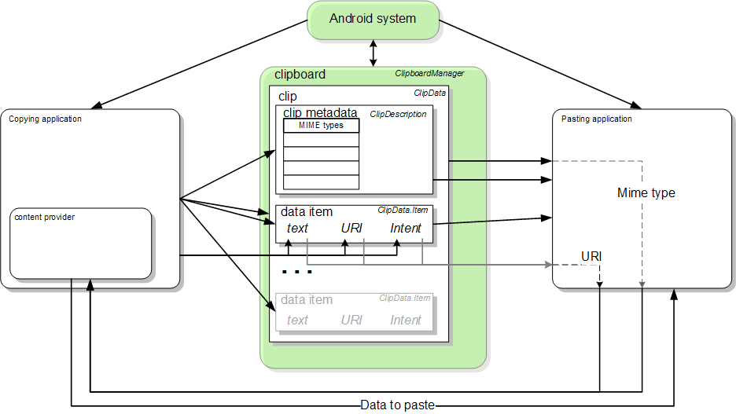

>『안드로이드 모바일 앱 모의해킹』을 참고해 금융권 앱을 모델로 가상으로 제작된 ‘인시큐어뱅크’ 앱으로 취약점 항목별로 실습을 했습니다.


## 13. 애플리케이션 디버깅 기능
### 13.1 취약점 소개
- 안드로이드 디버깅 모드의 설정 여부에 따라 발생하는 취약점이다.
- 개발 과정에서 사용하는 디버깅 모드가 배포할 때 `false` 로 지정하지 않아 발생하는 취약점이다.
- 이 취약점으로 인해 어떤 보안 위협을 줄 수 있는지는 뒤에 16장에 나온다

### 13.2 취약점 진단과정
`AndroidManifest.xml`

```java
<application
	android:theme="@android:style/Theme.Holo.Light.DarkActionBar"
	android:label="@string/app_name"
	android:icon="@mipmap/ic_launcher"
	android:debuggable="true"
	android:allowBackup="true">
```

- `debuggable="true"`을 통해 디버깅이 가능하다는 것을 확인할 수 있다.

### 13.3 취약점 대응 방안
- `debuggable` 을 `flase`로 바꾼다.
	- 개발자가 앱을 배포하기 전에 꼭 확인해야 한다.

<br><br>

---

## 14. 안드로이드 복붙 취약점
### 14.1 취약점 소개
- `Android Pasteboard Vulnerability`는 클립보드라는 공유 자원을 관리하는 방식에서 발생한다. 
- 안드로이드 시스템에서 클립보드는 여러 앱이 데이터를 주고받을 수 있도록 설계된 공용 공간인데 별도의 권한 없이 허가되지 않은 사용자가 확인할 수 있다.

> **안드로이드 10**부터는 현재 사용자가 화면에 띄워놓은 앱(포그라운드 앱)만 클립보드 데이터에 접근할 수 있도록 제한되었습니다.
> **안드로이드 13**부터는 클립보드에 민감한 정보(비밀번호 등)가 복사되면 시스템이 자동으로 미리보기 화면을 마스킹(가림 처리)하고, 일정 시간이 지나면 클립보드 내역을 자동으로 삭제하는 기능이 추가되었습니다.
{: .prompt-info }

#### Android Clipboard Framework
- 클립보드에 어떠한 과정을 통해 저장되고, 다른 앱에서 붙여넣기가 되는지 알아보자.



- 클립보드 기반의 프레임워크는 `text`, `URI`, `intent` 의 데이터 종류를 지원한다.
- 클립보드는 한 번에 한 가지 오브젝트만 저장하기 때문에 새로운 클립 오브젝트로 정보를 넣을 경우, 이전 클립 오브젝트의 정보는 사라진다.
- 안드로이드 시스템에서 클립보드는 `global clipboard class`로도 표현된다.
- 클립보드 매니저를 사용하기 위해 `getSystemService()` 메서드를 사용한다.

- 자세한 내용은 [안드로이드 공식사이트](https://developer.android.com/develop/ui/views/touch-and-input/copy-paste?hl=ko)에서 확인할 수 있다.

### 14.2 취약점 진단 과정
- 안드로이드 스튜디오는 PC 클립보드와 동기화하는 기능이 있어서 실습은 넘어간다.

#### 1. 클립보드 무단 접근 (Clipboard Snooping)
과거 안드로이드 버전(특히 10 미만)에서는 포그라운드(사용 중인 앱)와 백그라운드(숨어 있는 앱) 구분 없이 **어떤 앱이든 클립보드에 접근**하여 데이터를 읽어갈 수 있었습니다.
- **위험 요소:** 사용자가 비밀번호 관리 앱에서 비밀번호를 복사하거나, 금융 앱에서 계좌 번호를 복사했을 때, 악성 앱이 백그라운드에서 이를 실시간으로 가로챌 수 있습니다.      

#### 2. 클립보드 변조 공격 (Clipboard Modification)
공격자가 클립보드 내용을 읽는 것에 그치지 않고, 내용을 **몰래 수정**하는 방식입니다.
- **공격 시나리오:** 사용자가 가상화폐 지갑 주소를 복사하여 송금하려고 할 때, 악성 앱이 클립보드의 주소를 **공격자의 지갑 주소**로 바꿔치기합니다. 주소가 길고 복잡하기 때문에 사용자는 눈치채지 못하고 공격자에게 돈을 보낼 위험이 있습니다.    

#### 3. 민감 정보 노출 (Sensitive Data Exposure)
앱 개발자가 클립보드에 들어가는 데이터의 성격을 지정하지 않아 발생하는 문제입니다.
- **취약점:** 비밀번호, 신용카드 번호, OTP 인증 코드 등은 클립보드에 남지 않거나 즉시 삭제되어야 합니다. 하지만 일부 앱은 이러한 데이터를 일반 텍스트로 처리하여 다른 앱이 읽을 수 있게 방치합니다.
- 복사/붙여넣기는 안드로이드에서 제공하는 기본적인 기능이기 때문에 특별한 권한을 요구하지 않으며, 간단한 메서드 사용만으로도 데이터 추출이 가능하다.

### 14.3 취약점 대응 방안
- 클립보드에 대한 보안은 보안 솔루션을 이용해 대응할 수 있다
	- 클립보드에 존재하는 데이터를 제한된 시간동안만 유지하도록 설정하고, 설정한 시간이 지나면 삭제하도록 하는 것이 일반적인 대응 방법이다.
	- 일정 시간 동안 앱에 접근하지 않을 경우, 해당 앱의 데이터베이스 접근 권한을 막아버리는 대응 방법도 있다.
- **안드로이드 10**부터는 현재 사용자가 화면에 띄워놓은 앱(포그라운드 앱)만 클립보드 데이터에 접근할 수 있도록 제한되었다.
- **안드로이드 13**부터는 클립보드에 민감한 정보가 복사되면 시스템이 자동으로 미리보기 화면을 마스킹(가림 처리)하고, 일정 시간이 지나면 클립보드 내역을 자동으로 삭제하는 기능이 추가되었다.


<br><br>

---

## 15. 안드로이드 백업 취약점
### 15.1 취약점 소개
- 안드로이드는 사용자가 기기를 변경하거나 초기화했을 때 데이터를 복구할 수 있도록 **백업 기능**을 제공한다.
-  기능은 기본적으로 활성화되어 있는데, 만약 개발자가 서비스 앱을 만들 때 이를 별도로 제한하지 않으면 **루팅되지 않은 기기에서도 `adb` 를 통해 앱의 내부 데이터를 PC로 추출**할 수 있게 된다.

### 15.2 취약점 진단 과정
`AndroidManifest.xml`

```java
<application  
	android:theme="@android:style/Theme.Holo.Light.DarkActionBar"
	android:label="@string/app_name"
	android:icon="@mipmap/ic_launcher"
	android:debuggable="true"
	android:allowBackup="true">
```
- 인시큐어뱅크 `AndroidManifest`파일의 `allowBackup` 속성은 `true`으로 설정되어 있으며, 전체 백업 수행이 가능하다.

#### 전체 백업과 파일 추출
>안드로이드 12(API 31)부터 구글은 `adb backup` 기능을 통한 데이터 유출을 막기 위해 기본적으로 `adb backup`이 작동하지 않도록 설정을 변경했습니다
{: .prompt-info }

- 전체 백업 방법은 별도의 프로그램 설치 없이 안드로이드 SDK를 통해 제공되는 ADB 명령을 이용하면 된다.

```
# 전체 백업 (애플리케이션, 애플리케이션 데이터, 저장소 파일, 시스템 애플리케이션)
adb backup -all -apk -shared -system -f <저장 파일명.ab>

# 특정 애플리케이션 백업
adb backup 패키지명 -f <저장 파일명.ab>
adb backup com.android.insecurebankv2 -f insecurbankv2.ab
```

- .ab 파일이 추출되었다면 `ABE`(android backup extractor)라는 응용 프로그램으로 압축을 해체한다.
```
	java -jar "abe.jar경로" unpack insecurebankv2.ab insecurebankv2.tar
```
- tar 아카이브 파일로 변환되었으며, tar 명령을 이용하면 아카이브에 포함된 파일 추출이 가능해진다.
- 만약 파일이 암호화되어 있는 경우, 명령어 뒤에 백업 시 입력했던 암호를 추가하면 파일이 정상적으로 변환된다.

- 파일 내용을 수정해서 다시 폰에 넣는(복원) 과정을 하기 위해서는 변환된 파일 목록을 확인하기 전에 아카이브에 포함된 리스트를 별도로 저장해야한다.
	- 안드로이드는 백업 파일을 복원할 때, 파일의 순서와 목록이 처음 백업했을 때와 100% 똑같아야만 받아주기 때문이다.
	- 따라서 별도로 리스트를 저장해 놓고 복원과정을 진행하면서 처음 리스트 그대로 아카이브를 만드는 데 사용한다.

```
	tar -tf insecurebankv2.tar > insecurebankv2.list
	
	#조작 후
	java -jar "abe.jar경로" pack insecurebankv2_new.tar insecurebankv2_new.ab
	adb restore insecurebankv2_new.ab
```

### 15.3 취약점 대응 방안
- `allowBackup` 속성을 false로 설정하거나 삭제한다.

<br><br>

---


## 16. 런타임 조작
### 16.1 취약점 소개
- "13. 애플리케이션 디버깅 기능"에서 발생한 취약점이 발견된다.
- 앱이 실행되는 도중 **메모리상에 악의적인 행동을 하는 취약점**이다.

### 16.2 취약점 진단 과정
- 안드로이드 단말에서 `jdb`에 사용할 디버깅 포트를 찾기 위해는 `adb jdwp` 명령어를 사용한다.
- 인시큐어뱅크 앱의 사용 전후로 명령어를 입력해서 후자에 생긴 번호가 디버깅을 할 수 있는 포트 번호다.
	- 이 포트 번호는 매번 변경되기 때문에 실습마다 확인해야한다.

```
# adb forward tcp:1111 jdwp:포트번호
# jdb -connent com.sun.jdi.SockerAttach:hostname=localhost,prot=1111

Set uncaught java.lang.Throwable
Set deferred uncaught java.lang.Throwable
Initializing jdb ...
>
```
- adb를 통해 디버깅 포트를 로컬 포트로 포트포워딩해준 후, jdb 명령어를 통해 로컬 디버깅 포트로 연결한다.


```
adb shell am start -n com.android.insecurebankv2/.ChangePassword
```
- 강제로 실행시킨 경우에는 사용자 이름이 빈칸으로 되어 있으며, 사용자 임의로 값을 넣을 수 없다.

- 이번에는 `ChangePassword` 액티비티가 시작될 때 브레이크를 걸고 분석해본다.

```
> stop in com.android.insecurebankv2.ChangePassword.onCreate
Set breakpoint com.android.insecurebankv2.ChangePassword.onCreate
```

#### 브레이크 포인트 설정
- 이제 다시 액티비티를 실행하면 정상적으로 브레이크 포인트에 위치한다.

```
> stop in com.android.insecurebankv2.ChangePassword.onCreate
Set breakpoint com.android.insecurebankv2.ChangePassword.onCreate
>
Breakpoint hit: "thread=main", com.android.insecurebankv2.ChangePassword.onCreate(), line=75 bci=1

main[1]
```
- 위에서 **line75** 라는 부분을 확인할 수 있다.
- 이는 `ChangePassword`의 smali 코드에 적힌 부분과 같다.
```
.line 75  
invoke-super {p0, p1}, Landroid/app/Activity;->onCreate(Landroid/os/Bundle;)V
```

- smali 코드를 분석하면 `uname` 이라는 변수를 볼 수 있다.
```
.line 85  
.local v0, "intent":Landroid/content/Intent;  
const-string v1, "uname"
```
- 이 변수가 사용자의 이름과 관계 있다고 생각된다면, `jdb`에서 next 명령을 통해 85번 라인까지 이동하면된다.
- 그 후 uname을 "dinesh"로 지정해줄 수 있다.

```
main[1] next
>
Step completed: "thread=main", com.android.insecurebankv2.ChangePassword.onCreate(), line=85 bci=51

main[1] next
>
Step completed: "thread=main", com.android.insecurebankv2.ChangePassword.onCreate(), line=86 bci=59

main[1] print this.uname
 this.uname = null
main[1] set this.uname = "dinesh"
 this.uname = "dinesh" = "dinesh"
main[1] print this.uname
 this.uname = "dinesh"
main[1]
```


- run 명령어를 입력해보면 사용자 ID란에 dinesh가 들어감을 볼 수 있다.
- 이제 비밀번호를 입력하고 버튼을 누르면, 공격자는 로그인을 하지 않고 `dinesh 계정`의 비밀번호를 바꿀 수 있다.

### 16.3 취약점 대응 방안
- 13절과 마찬가지로 `debuggable` 속성이 `true`로 설정되어 있기 때문에 발생했던 취약점이다.
- 소스 코드 난독화를 적용한다.
	- 디컴파일을 통해 smali코드를 확인했을 때 특별한 어려움 없이 소스 코드의 흐름을 알 수 있었다.
	- 하지만 소스 코드 난독화가 적용되어 있었다면 위처럼 쉽게 취약점을 확인하지 못한다.

<br><br>

## 참고
『안드로이드 모바일 앱 모의해킹』(조정원)