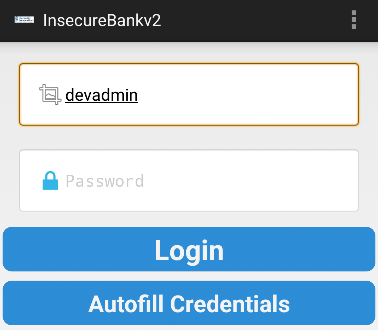
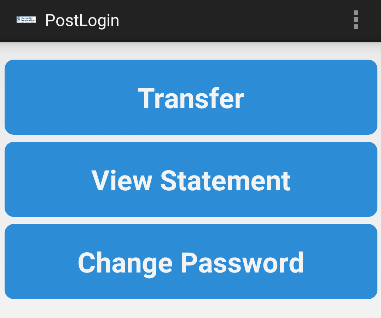
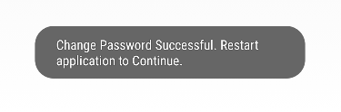
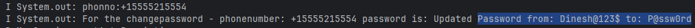
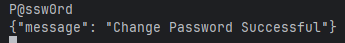

>『안드로이드 모바일 앱 모의해킹』을 참고해 금융권 앱을 모델로 가상으로 제작된 ‘인시큐어뱅크’ 앱으로 취약점 항목별로 실습을 했습니다.


## 17. 안전하지 않은 SD 카드 저장소
### 17.1 취약점 소개
- Insecure SDCard storage는 애플리케이션이 SD 카드 저장소에 중요한 정보나 파일을 저장하여 발생하는 취약점이다.
- **OWASP Mobile Top 10**(2024) M9: Insecure Data Storage에 해당한다.
> **안드로이드 10(API 29) 이상**부터 도입된 **Scoped Storage**를 적용하면, 앱이 외부 저장소를 사용하더라도 자기 앱의 전용 디렉토리에만 접근할 수 있다.

- 안드로이드의 저장 공간은 크게 **내부 저장소**와 **외부 저장소**로 나뉜다.
	- **내부 저장소:** 앱 전용 공간으로, 해당 앱만 접근 가능하며 OS 수준에서 샌드박싱되어 안전하다.    
	- **외부 저장소 (SD 카드 등):** 과거 안드로이드 버전에서는 모든 앱이 읽기/쓰기 권한(`READ/WRITE_EXTERNAL_STORAGE`)만 있으면 이 영역의 모든 파일에 접근할 수 있다.
- 따라서 민감한 정보를 SD 카드에 저장하면, **악의적인 다른 앱이 그 데이터를 훔쳐보거나 수정**할 수 있게된다.

### 17.2 취약점 진단
#### SDCard storage 확인
```
# adb shell
generic_x86_64:/ # cd /mnt/sdcard
generic_x86_64:/mnt/sdcard # ls -l

total 96
drwxrwx--x 2 root sdcard_rw 4096 2026-01-03 14:22 Alarms
drwxrwx--x 4 root sdcard_rw 4096 2026-01-03 14:22 Android
drwxrwx--x 2 root sdcard_rw 4096 2026-01-03 14:22 DCIM
drwxrwx--x 2 root sdcard_rw 4096 2026-01-08 08:28 Download
drwxrwx--x 2 root sdcard_rw 4096 2026-01-03 14:22 Movies
drwxrwx--x 2 root sdcard_rw 4096 2026-01-03 14:22 Music
drwxrwx--x 2 root sdcard_rw 4096 2026-01-03 14:22 Notifications
drwxrwx--x 2 root sdcard_rw 4096 2026-01-03 14:22 Pictures
drwxrwx--x 2 root sdcard_rw 4096 2026-01-03 14:22 Podcasts
drwxrwx--x 2 root sdcard_rw 4096 2026-01-03 14:22 Ringtones
-rw-rw---- 1 root sdcard_rw  290 2026-01-08 08:21 Statements_dinesh.html
```

- 외부 저장소인 `/mnt/sdcard`에 접근하여 어떤 디렉터리 및 파일들이 존재하는지 확인한다.
- `Statements_dinesh.html`을 확인하면 사용자의 거래 정보가 있음을 확인할 수 있다.
	- 중요한 거래 정보는 외부 저장소에 저장되면 안된다.

#### Local Storage 확인
- 내부 저장소를 진단하기 위해서는 디바이스가 루팅되어 있어야 한다.

```
# cd data/data/com.android.insecurebankv2/
/data/data/com.android.insecurebankv2 # ls
app_textures
app_webview
cache
databases
files
shared_prefs

/data/data/com.android.insecurebankv2/shared_prefs # ls
WebViewChromiumPrefs.xml 
com.android.insecurebankv2_preferences.xml 
mySharedPreferences.xml
```
- 접근한 파일들 중에서 취약점이 도출될 수 있다고 생각하는 파일을 선택한다.

```
# adb pull /data/data/com.android.insecurebankv2/shared_prefs/mySharedPreferences.xml
/data/data/com.android.insecurebankv2/shared_prefs/mySh... file pulled, 0 skipped. 0.3 MB/s (221 bytes in 0.001s)

# cat .\mySharedPreferences.xml
<?xml version='1.0' encoding='utf-8' standalone='yes' ?>
<map>
    <string name="superSecurePassword">DTrW2VXjSoFdg0e61fHxJg==&#10;    </string>
    <string name="EncryptedUsername">ZGluZXNo&#13;&#10;    </string>
</map>
```
- `mySharedPreferences.xml` 파일에 저장된 `superSecurePassword`와 `EncryptedUsername`의 문자열이 보인다.
- 해당 값은 AES와 Base64로 암호화, 인코딩되어 있고, 8절의 **안전하지 않은 암호화** 취약점으로 이어질 수 있다.

### 17.3 취약점 대응 방안
- 민감한 정보는 반드시 앱 전용 내부 저장소(`data/data/<package_name>/`)에 저장한다.
	- "setStorageEncryption" API 를 이용해 내부 저장소에 저장되는 파일을 강제로 암호화할 수 있다.
- **안드로이드 10(API 29)** 이상부터 도입된 **Scoped Storage**를 적용하면, 앱이 외부 저장소를 사용하더라도 자기 앱의 전용 디렉토리에만 접근할 수 있어 보안성이 크게 향상된다.
- `SharedPreferences`를 사용할 때는 모드 설정에 주의해야 한다.
	- MODE_PRIVATE : 앱 내부에서만 접근할 수 있다. 
	- `MODE_WORLD_READABLE`, `MODE_WORLD_WRITEABLE` : 다른 앱에서의 접근을 허용한다.

<br><br>

---

## 18. 개발자 백도어
### 18.1 취약점 소개
- 백도어란, 정상적인 프로그램에 자신만이 들어갈 수 있는 코드를 삽입해 정당한 인증 과정을 거치지 않고 접속할 수 있는 통로를 만드는 방법이다.
- 개발자들이 유지보수나 디버깅 시 인증 및 셋업 시간 등을 단축하기 위한 요소로 만들 때도 있지만, 일부 개발자는 인증을 회피할 목적으로 만들기도 한다.
- 이러한 개발자의 백도어가 공격자에게 발견되면 시스템에 큰 위험을 초래한다.

### 18.2 취약점 진단 과정
`DoLogin.java`

```java
public void postData(String valueIWantToSend) {
	HttpResponse responseBody;
	HttpClient httpclient = new DefaultHttpClient();
	HttpPost httppost = new HttpPost(DoLogin.this.protocol + DoLogin.this.serverip + ":" + DoLogin.this.serverport + "/login");
	HttpPost httppost2 = new HttpPost(DoLogin.this.protocol + DoLogin.this.serverip + ":" + DoLogin.this.serverport + "/devlogin");
	List<NameValuePair> nameValuePairs = new ArrayList<>(2);
	nameValuePairs.add(new BasicNameValuePair("username", DoLogin.this.username));
	nameValuePairs.add(new BasicNameValuePair("password", DoLogin.this.password));
	if (DoLogin.this.username.equals("devadmin")) {     // 백도어
		httppost2.setEntity(new UrlEncodedFormEntity(nameValuePairs));
		responseBody = httpclient.execute(httppost2);
	} else {
		httppost.setEntity(new UrlEncodedFormEntity(nameValuePairs));
		responseBody = httpclient.execute(httppost);
	}
```
- DoLogin.java의 postData 함수를 보면 개발자의 백도어 로직을 볼 수 있다.
- https를 선언해 `username`이 `devadmin`이면 암호 인증 처리 없이 로그인이 가능해진다.

<div style="text-align: center;">
  
  
</div>

- 실습으로 비밀번호를 입력하지 않고 아이디에 `devadmin` 만 입력한 채 버튼을 누르면, 인증 우회가 성공한다.

### 18.3 취약점 대응 방안
- 개발자는 백도어를 잘 확인하여, 배포전에 삭제해야한다.

<br><br>

---

## 19. 취약한 패스워드 변경 실행
### 19.1 취약점 소개
- **취약한 패스워드 변경 실행**은 패스워드 변경 과정에서, 개발자의 실수로 불필요한 로그를 남겨 패스워드를 노출하는 취약점이다.
- 배포되는 앱에 취약한 인증으로 인해 패스워드 변경이 일어나면, 중요 정보 및 민감 정보가 대량으로 노출될 수 있는 보안 위협이 존재한다.

### 19.2 취약점 진단 과정
- 암호화 변경 로직을 살펴보기 위해서는 `logcat`나 `wireshark` 같은 프록시 도구를 사용한다.


- 비밀번호를 `P@ssw0rd`로 바꿔보자.


- logcat을 통해 보면, 이전 비밀번호와 바뀌는 비밀번호가 모두 평문으로 출력된다.


- 서버에도 마찬가지다.

- 이러한 문제점은 `ChangePassword.java`파일에 있다.
	- 패스워드 변경에 필요한 값들을 Vector로 `BasicNameValuePair(key, value)`에 넣고 패스워드를 처리하는 마지막 과정까지 암호화와 관련된 로직이 존재하지 않는다.
	
```java
List<NameValuePair> nameValuePairs = new ArrayList<>(2);  
nameValuePairs.add(new BasicNameValuePair("username", ChangePassword.this.uname));  
nameValuePairs.add(new BasicNameValuePair("newpassword", ChangePassword.this.changePassword_text.getText().toString()));
```

### 19.3 취약점 대응 방안
- 개인 정보 또는 금융 거래 정보는 스마트폰 입력단부터 금융 회사 전자 금융 서버까지 전 구간을 암호화하여 전송해야 한다.
- 패스워드를 암호화되지 않은 텍스트 형태로 저장하는 것은 인증 우회가 가능하므로 주의해야 한다.
- 로그 파일에 패스워드를 평문으로 저장하면 로그 파일에 접근할 수 있는 사람 모두가 패스워드를 알아낼 수 있다.
- 패스워드는 높은 수준의 암호화 알고리즘을 사용하여 관리되어야하며, 쉽게 접근할 수 없는 저장소나 암호화된 상태로 저장해야한다.

<br><br>

## 참고
『안드로이드 모바일 앱 모의해킹』(조정원)